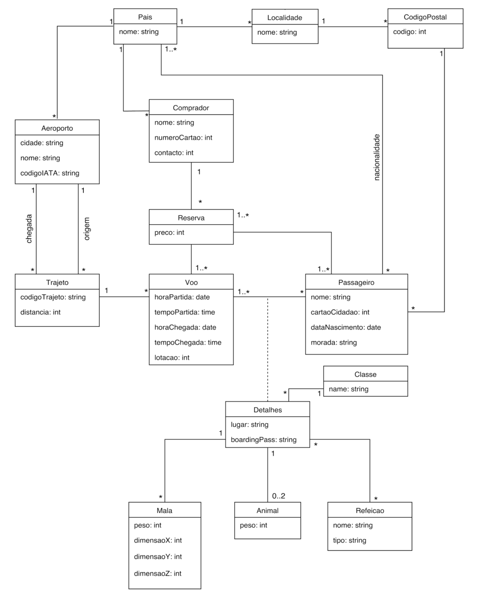

# BDAD Databases
Projects made in Databases class - MIEIC 2y2s 

The project consists in creating a database for an airline with relevant information for a user, as the price calculation algorithm that bases on the choices of the user.

## UML Diagram

